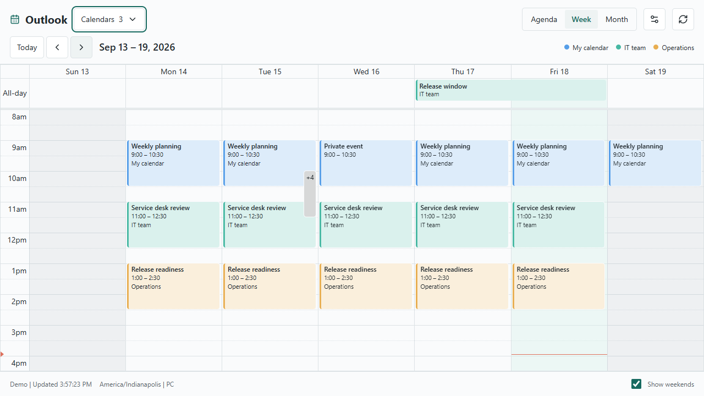
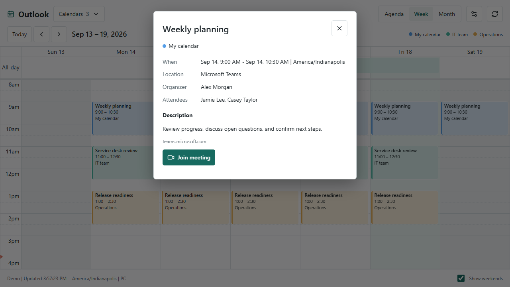
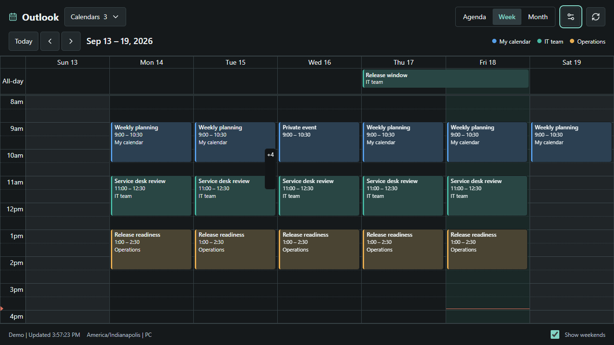
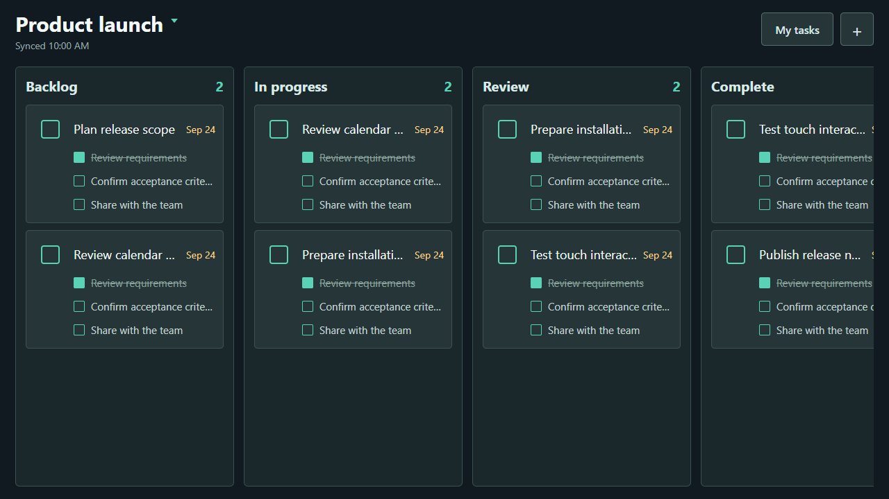
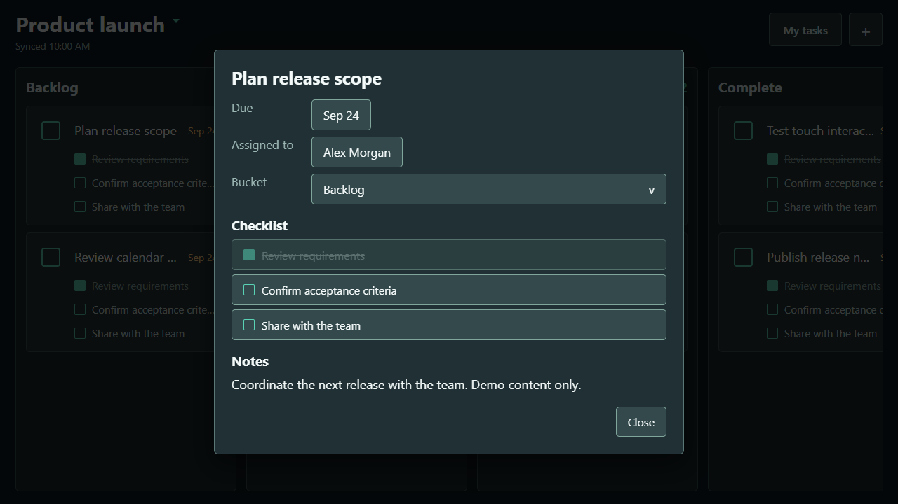
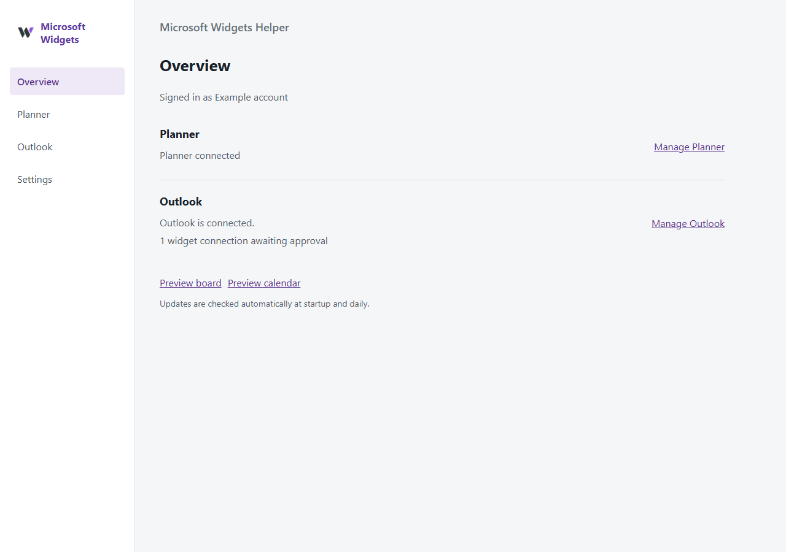

# XENEON Widgets

Microsoft Planner and Outlook on the XENEON EDGE, backed by a shared Windows helper for Microsoft integrations.

## Install

Download the **MicrosoftWidgetsSetup** installer from the [latest release](https://github.com/Knack25/Xeneon-Widgets/releases/latest). The installer includes the helper, Planner and Outlook widgets, Start menu shortcuts, and an optional Windows startup setting. No terminal commands or separate runtime installation are needed.

Follow the setup page to connect your work account, choose a board, and download the widget for import into iCUE. See the [installation guide](docs/INSTALL.md) for upgrades, Microsoft permissions, and portable use.

## Projects

- [Microsoft Widgets Helper](microsoft-widgets-helper/README.md): shared sign-in, setup, local service, and integration modules.
- [Planner Edge Widget](planner-edge-widget/README.md): board display, task details, checklists, filtering, assignments, dates, and task creation.
- [Outlook Edge Widget](docs/OUTLOOK.md): read-only calendars, Week/Month/Agenda views, event details, and meeting launch.

## Screenshots

All previews use fictional demo data. Dark-mode controls shown here are in development and are not included in release 0.3.2.

### Outlook

### Planner

### Helper

## Build a release

Install the .NET 10 SDK, Node.js, and Inno Setup 6. Run `npm ci` in `planner-edge-widget/widget`, then run `scripts/build-release.ps1` from the repository root. It runs tests and builds the installer, portable archive, widget package, guide, and checksums in `dist/release`.

Use [Conventional Commits](https://www.conventionalcommits.org/en/v1.0.0/) for repository changes.
